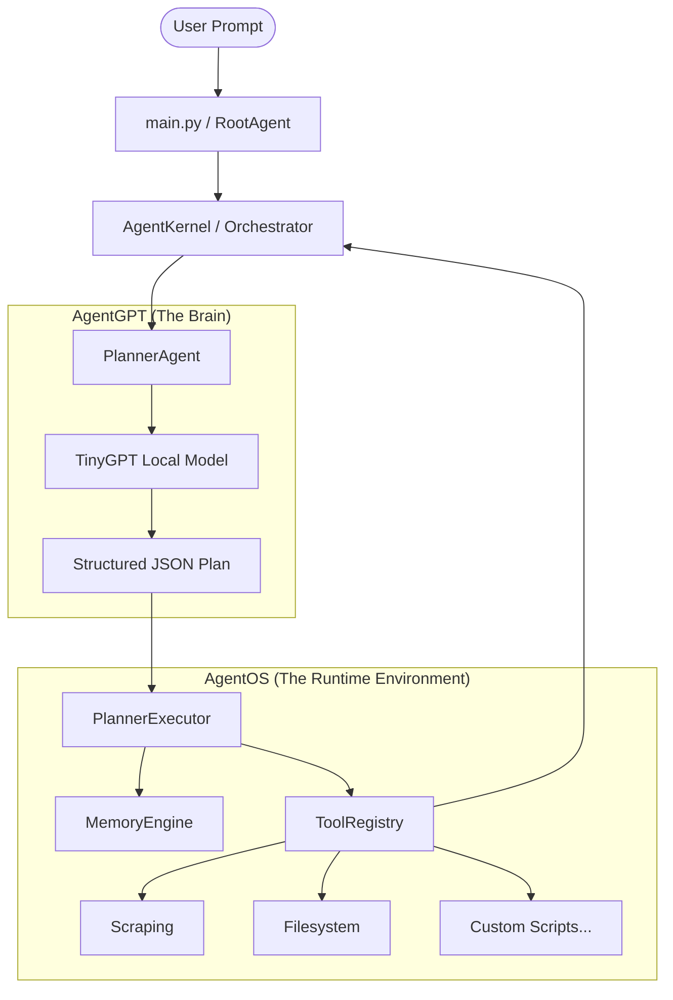

# AgentOS

AgentOS is a framework for creating and running autonomous AI agents. It acts as an operating system for agents, breaking down complex natural language tasks into actionable, structured plans, and executing them using a customized suite of tools. 

At its core, AgentOS operates using a completely local, custom-trained transformer model (`TinyGPT`), providing end-to-end control from mission planning to task execution.

## Architecture Diagram



## Custom Transformer Model (`TinyGPT`)

AgentOS relies on `TinyGPT`, a lightweight, custom-built Transformer model written from scratch in PyTorch. 
- **Architecture**: It utilizes token and positional embeddings, followed by a stack of self-attention blocks (`nn.TransformerEncoderLayer`), normalized using LayerNorm, and capped with a linear head mapped to the custom SentencePiece vocabulary size.
- **Inference**: The model features a custom `generate` loop for autoregressive inference, generating tokens one-by-one to formulate actionable tool plans.

## Training Pipeline

The repository includes a dedicated pipeline to train the `TinyGPT` model to output deterministic structured plans instead of open-ended conversational text:
1. **Data Preparation**: Training data consists of raw prompt-completion pairs where the prompt is a natural language task (e.g., "Extract keywords...") and the completion is a structured JSON tool call (e.g., `<START>{"tool": "extract_keywords"}<END>`).
2. **Tokenization**: The pipeline uses a custom `SentencePiece` tokenizer (`spm.model`) trained on the specific command corpus. 
3. **Training Script**: Run `agentgpt/training/train_general_gpt.py`. The model learns using standard causal language modeling (`CrossEntropyLoss` shifted by one token) and calculates gradients optimized via AdamW over batches.
4. **Weights Base**: The final output is bundled into `model_general_sp.pth`, which contains both the serialized `state_dict` and the tokenizer path.

## Example JSON Planning Output

When given a prompt, `TinyGPT` doesn't respond with conversational chat—it directly outputs a strict, actionable JSON outline:

**User Prompt:**  
`Extract keywords from the following paragraph and email me the results: 'AgentOS is the future of autonomous task execution and AI-driven productivity.'`

**Planner Output:**
```json
[
  {
    "type": "tool",
    "tool": "extract_keywords",
    "args": {
      "text": "AgentOS is the future of autonomous task execution and AI-driven productivity."
    }
  },
  {
    "type": "tool",
    "tool": "send_email",
    "args": {
      "to": "me@example.com",
      "subject": "Extracted Keywords",
      "body": "AgentOS, autonomous, AI-driven"
    }
  }
]
```

## Key Features

- **Recursive Autonomous Agents**: Agents can intelligently break down high-level missions into sub-tasks and spawn sub-agents to handle them.
- **Custom Local LLM**: No API keys required. Everything runs locally on the integrated PyTorch `TinyGPT` architecture.
- **Centralized Orchestration**: The `AgentKernel` manages context variables alongside short-term and long-term memory.
- **Extensible Tool Registry**: A plug-and-play tool system where agents can run bash commands, scrape the web, send emails, or execute custom Python functions via `tool_registry.json`.

## Getting Started

### Prerequisites
- Python 3.10+
- `PyTorch`
- `sentencepiece`
- `beautifulsoup4`

*(It is recommended to use the generated `venv` or `venv311` for isolating dependencies).*

### Training the Model
```bash
python agentgpt/training/train_general_gpt.py
```

### Running the Agent Kernel (System Test)
```bash
python agentos/agent_kernel.py
```

### Running the Interactive Agent (Entry Point)
To start the root agent with an interactive prompt:
```bash
python main.py
```

## Extending AgentOS (Adding New Tools)

You can easily equip AgentOS with new capabilities. 
1. **Write the Tool**: Create your Python function in `agentos/tools.py`.
2. **Register the Schema**: Open `tool_registry.json` and add your function's signature, expected arguments, and module name.
3. **Load the Tool**: Ensure `AgentKernel.load_tools()` points to your new implementation.

Next time the `PlannerAgent` processes a task, it will automatically leverage your new capabilities!
